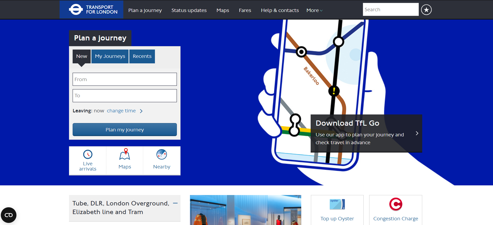
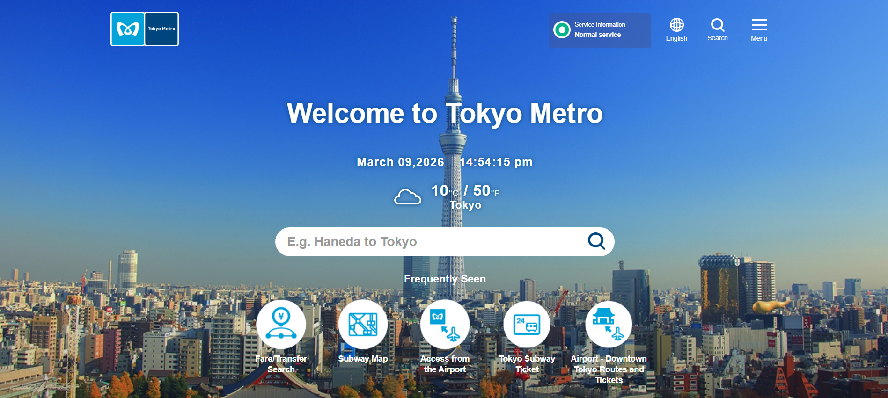

# Metro System Research & Brainstorm

**Researcher:** Enuka Gayashan Balasooriya 
**Date:** 2026-03-09  
**Branch:** `doc/gayashan-research`

---

## 1. Websites Reviewed

| # | Country | System Name | URL | Date Visited |
|---|---------|-------------|-----|--------------|
| 1 | Singapore | SimplyGo | https://www.simplygo.com.sg/ | 2026-03-10 |
| 2 | London | Transport for London | https://tfl.gov.uk | 2026-03-10 |
| 3 | Tokyo | Tokyo Metro | https://www.tokyometro.jp/en | 2026-03-10 |

> ⚠️ **Note:** You must visit these websites yourself and take your own screenshots. Do not copy content from AI tools.

---

## 2. Key Features Observed

### 🔵 Singapore – SimplyGo

*Screenshot taken: 2026-03-10*

**Features noticed:**
- Fare calculator
- Mobile app download links prominently placed
- Has a chatbot for further clarifications

**My observation:** The fare calculator is very user-friendly. Even a first-time visitor can plan a trip easily.

---

### 🔴 London – Transport for London (TfL)

*Screenshot taken: 2025-03-01*

**Features noticed:**
- Live status updates for each line
- Accessibility information (step-free access)
- Oyster card / contactless payment info
- Journey planner with multiple transport modes
- Disruption alerts banner at the top

**My observation:** TfL handles disruptions very transparently. Sri Lanka could benefit from a clear "service status" section so passengers aren't confused during delays.

---

### 🟠 Tokyo Metro

*Screenshot taken: 2026-03-10*

**Features noticed:**
- Date time and weather information
- Extremely detailed route map (interactive)
- Tourist-focused features (English, Chinese, Korean, etc.)
- Station facilities info (toilets, elevators, exits)
- Lost and found section
- IC card (Suica/Pasmo) information

**My observation:** Tokyo provides station-level details which is great. For Sri Lanka, showing nearby landmarks for each station would help tourists.

---

## 3. UI/UX Observations

| Aspect | What I Noticed | Good for Sri Lanka? |
|--------|---------------|---------------------|
| Color scheme | Each system has a consistent brand color | ✅ Yes – use Sri Lankan national colors |
| Navigation | Simple top nav with 4-5 main items | ✅ Yes – keep it minimal |
| Mobile responsiveness | All three sites work well on phone | ✅ Must have |
| Language support | Multiple languages available | ✅ Sinhala, Tamil, English needed |
| Maps | Interactive SVG/JS maps | ✅ Priority feature |
| Accessibility | TfL has the best accessibility info | ✅ Include for inclusivity |

---

## 4. Suggested Features for Sri Lanka Metro Website

### Must Have
- [ ] Interactive route map
- [ ] Station list with nearby landmarks
- [ ] Fare information
- [ ] Operating hours
- [ ] Sinhala / Tamil / English language toggle

### Good to Have
- [ ] Real-time train status
- [ ] Journey planner
- [ ] Mobile app link
- [ ] News & announcements section
- [ ] Contact / lost & found

### Future Consideration
- [ ] Tourist guide integration
- [ ] QR code ticketing info
- [ ] Accessibility guide per station

---

## 5. My Personal Opinion

> *Write this in your own words. What did you personally find most useful? What do you think Sri Lanka needs most?*

I think Sri Lanka's metro website should prioritize **simplicity and mobile-first design** because most users will access it from their phones. The Singapore model is the best reference because it balances simplicity with useful features without overwhelming the user.

The most important feature for Sri Lanka would be **multilingual support** since both Sinhala and Tamil-speaking communities need to use the system comfortably.

---

## 6. References

- TransitLink Singapore – https://www.transitlink.com.sg – visited 2025-03-01
- Transport for London – https://tfl.gov.uk – visited 2025-03-01
- Tokyo Metro – https://www.tokyometro.jp/en – visited 2025-03-02
