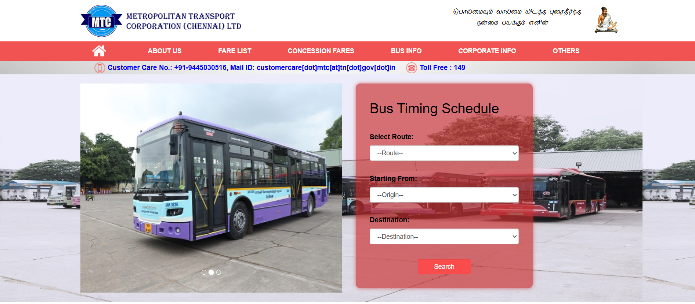
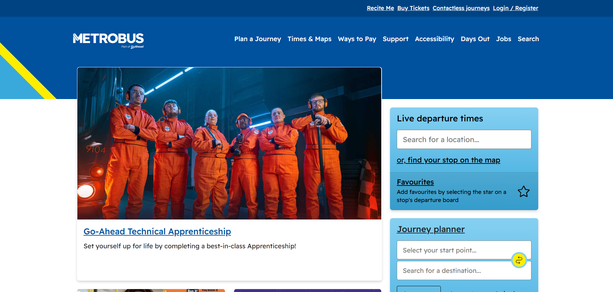
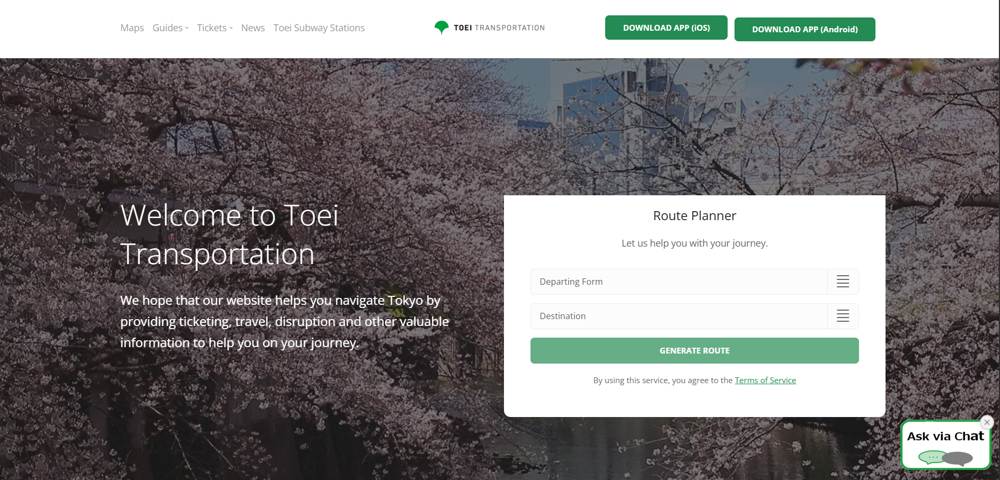

# Metro System Research & Brainstorm

**Researcher:** Kavishka Rasanjana Jayathissa  
**Date:** 2026-03-08  
**Branch:** `doc/kavishka-research`

---

## 1. Websites Reviewed

| # | Country | System Name | URL | Date Visited |
|---|---------|-------------|-----|--------------|
| 1 | Singapore | TransitLink | https://www.transitlink.com.sg | 2026-03-08 |
| 2 | India | MTC Chennai | https://mtcbus.tn.gov.in/Home/fares | 2026-03-08 |
| 3 | United Kingdom | Metrobus UK | https://www.metrobus.co.uk/ | 2026-03-08 |
| 4 | Japan | Tokyo Metro | https://www.tokyometro.jp/en | 2026-03-08 |

> ⚠️ **Note:** I visited these websites and took my own screenshots which are saved in the `screenshots/` folder.

---

## 2. Key Features Observed

### 🔵 Singapore – TransitLink

*Screenshot taken: 2026-03-08*

**Features noticed:**
- Very clean homepage.
- Easy to use fare calculator.
- Shows exactly how to use their travel cards.

**My observation:** The fare calculator is super useful. If a passenger knows the exact ticket price before getting on the bus or train, we can stop the daily arguments over balance money in Sri Lanka.

---

### 🟠 India – MTC Chennai

*Screenshot taken: 2026-03-08*

**Features noticed:**
- Shows bus fares based on "Stages" (Stage 1, Stage 2, etc.).
- Details about daily passes and monthly passes.
- Website design is a bit old and basic, but the information is very detailed.

**My observation:** This system is exactly like our SLTB (Langama) bus system. They calculate fares using stages just like we do. Even though their website doesn't look very modern, the way they have displayed the fare stage tables is a great practical example for our database design.

---

### 🔴 United Kingdom – Metrobus UK

*Screenshot taken: 2026-03-08*

**Features noticed:**
- Live bus tracking on a map.
- Very modern and mobile-friendly design.
- "Plan your journey" feature right on the front page.
- Clear alerts if a bus is delayed or a route is changed.

**My observation:** The live tracking feature is exactly what Sri Lanka needs. The biggest problem we face is waiting at the bus halt for hours not knowing if the bus will come or not. A live map like this would be a game changer for us.

---

### 🟢 Japan – Tokyo Metro

*Screenshot taken: 2026-03-08*

**Features noticed:**
- Extremely detailed route map (interactive).
- Tourist-focused features (English, Chinese, Korean).
- Station facilities info (toilets, elevators, exits).
- IC card (Suica/Pasmo) information.

**My observation:** The punctuality and the level of detail provided by Tokyo Metro are amazing. For Sri Lanka, providing station-level details (like nearby landmarks and facilities) would be a huge help, especially for tourists trying to navigate our system.

---

## 3. UI/UX Observations

| Aspect | What I Noticed | Good for Sri Lanka? |
|--------|---------------|---------------------|
| Color scheme | Metrobus UK and Tokyo Metro use bright brand colors. | ✅ Yes – we need a clean, trusting color theme. |
| Mobile responsiveness | UK, Japan, and Singapore sites work perfectly on mobile. | ✅ Must have. Most SL users will use mobile data. |
| Language support | MTC India and Tokyo Metro focus heavily on multiple languages. | ✅ Must have Sinhala, Tamil, and English. |
| Finding Info | UK site makes it very easy to find the next bus on the map. | ✅ Priority feature for our project. |

---

## 4. Suggested Features for Sri Lanka Metro Website

### Must Have
- [ ] Mobile-first responsive design.
- [ ] Live bus tracking map (Like Metrobus UK).
- [ ] Stage-based fare calculator (Like MTC India).
- [ ] Sinhala / Tamil / English language toggle.

### Good to Have
- [ ] Digital daily/monthly passes.
- [ ] Live alerts for broken down buses or traffic delays.
- [ ] Clear station and landmark details (Like Tokyo Metro).

### Future Consideration
- [ ] Connecting train times with bus times.
- [ ] Buying tickets directly from the website.

---

## 5. My Personal Opinion

> *Write this in your own words. What did you personally find most useful? What do you think Sri Lanka needs most?*

Doing this research gave me a clear idea of what we actually need to build. The MTC Chennai site proved that we can easily digitize our current "Fare Stage" system because they have done the exact same thing. But for the UI and user experience, we should definitely follow the Metrobus UK and Tokyo Metro models. 

In Sri Lanka, the two biggest headaches for a passenger are: 1. Not knowing when the transport will arrive, and 2. Fighting for change money. If our team can build a simple, fast-loading mobile website that shows a live map of the vehicle and a simple fare calculator, that alone will be a massive success for this government project. We don't need overly complex features right now; we just need reliability and transparency.

---

## 6. References

- TransitLink Singapore – https://www.transitlink.com.sg – visited 2026-03-08
- Metropolitan Transport Corporation (Chennai) – https://mtcbus.tn.gov.in/Home/fares – visited 2026-03-08
- Metrobus UK – https://www.metrobus.co.uk/ – visited 2026-03-08
- Tokyo Metro – https://www.tokyometro.jp/en – visited 2026-03-08