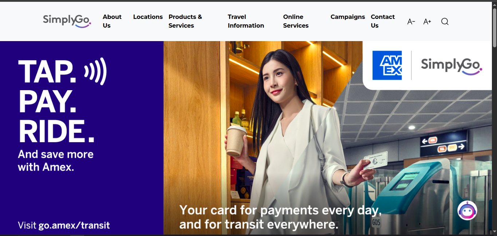
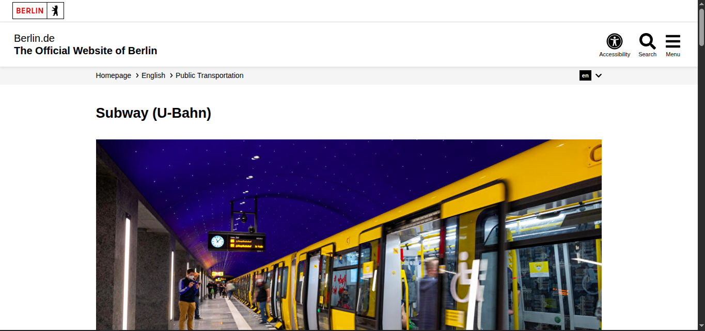

# Metro System Research & Brainstorm

**Researcher:** Wellappulige Lakshan Thenuka  
**Date:** 2026-03-09  
**Branch:** `doc/Lakshan51-research`

---

## 1. Websites Reviewed

| # | Country | System Name | URL | Date Visited |
|---|---------|-------------|-----|--------------|
| 1 | Singapore | SMRT / TransitLink |https://www.transitlink.com.sg | 2026-03-09 |
| 2 | London | Transport for London | https://tfl.gov.uk | 2026-03-09 |
| 3 | Tokyo | Tokyo Metro | https://www.tokyometro.jp/en| 2026-03-09 |
| 4 | Berlin | Berlin Metro | https://www.berlin.de/en/public-transportation/1742343-2913840-underground-subway.en.html | 2026-03-09 
|

> ⚠️ **Note:** You must visit these websites yourself and take your own screenshots. Do not copy content from AI tools.

---

## 2. Key Features Observed

### 🔵 Singapore – TransitLink

*Screenshot taken: 2026-03-09*

Features noticed:

-Interactive MRT and LRT route maps
-Journey planner to plan trips between stations
-Fare calculation for different routes
-Real-time public transport information
-Mobile application links for easy access
-Support for multiple languages

My observation:

The website is very simple and easy to use. The journey planner and fare calculator make it easy for passengers to quickly understand how to travel between locations.

---

### 🔴 London – Transport for London (TfL)

*Screenshot taken: 2026-03-09*

**Features noticed:**
-Live service status updates for underground lines
-Journey planner including bus, train, and underground
-Information about contactless and Oyster card payments
-Alerts and disruption notices on the homepage
-Accessibility information such as step-free stations

My observation:

The TfL website provides clear updates about delays or disruptions. This helps passengers stay informed and plan alternative routes if necessary.

---

### 🟠 Tokyo Metro

*Screenshot taken: 2026-03-09*

**Features noticed:**
-Detailed interactive metro route map
-Information about each station and its facilities
-Tourist information for foreign visitors
-Lost and found services
-Information about IC cards like Suica and Pasmo

My observation:

Tokyo Metro provides a lot of station-level information. This is especially useful for tourists who need directions, station exits, and nearby facilities.

---
### Berlin Metro

*Screenshot taken: 2026-03-09*

Features noticed:

- Detailed information about subway lines, routes, and stations
- Ticket and fare information for public transport
- Timetable details for train schedules
- 24-hour service during weekends
- Integrated ticket system for buses, trams, and trains
- Route maps for the entire metro network
- Accessibility information for passengers with disabilities

My observation: 

The Berlin U-Bahn website provides clear and detailed information about subway lines, schedules, and ticketing. I noticed that the system is well integrated with other transport services like buses and trams, which makes travelling easier for passengers. The availability of 24-hour service during weekends is also very useful for people who travel at night. For Sri Lanka, providing clear route maps and simple ticket information like this would help passengers plan their journeys more easily.

## 3. UI/UX Observations

| Aspect | What I Noticed | Good for Sri Lanka? |
|--------|---------------|---------------------|
| Color scheme | Each system uses a consistent color theme| ✅ Yes  |
| Navigation | Simple top navigation menu| ✅ Yes  |
| Mobile responsiveness | Websites work well on mobile devices| ✅ Essential |
| Language support | Multiple language options available | ✅ Sinhala / Tamil / English|
| Maps | Multiple language options available| ✅ Very important|
| Accessibility | TfL provides accessibility details| ✅ Should be included|

---

## 4. Suggested Features for Sri Lanka Metro Website

### Must Have
-Interactive metro route map
-Station list with nearby landmarks
-Fare information
-Train schedules and operating hours
-Sinhala / Tamil / English language selection

### Good to Have
-Real-time train status updates
-Journey planner between stations
-Mobile application download links
-News and service announcements
-Contact information and lost & found service

### Future Consideration
-Tourist information integration
-QR code ticketing system
-Accessibility information for each station

---

## 5. My Personal Opinion

In my opinion, the Sri Lanka metro website should focus mainly on simplicity and usability. Many passengers will use mobile phones to access the system, so the website should be optimized for mobile devices.

Among the websites reviewed, the Singapore TransitLink website provides a good balance between simplicity and functionality. It allows users to quickly check fares, routes, and travel options.

For Sri Lanka, the most important feature would be multilingual support. Providing Sinhala, Tamil, and English will ensure that the system is accessible to both local passengers and international visitors.

## 6. References

- TransitLink Singapore – https://www.transitlink.com.sg – visited 2026-03-09
- Transport for London – https://tfl.gov.uk – visited 2026-03-09
- Tokyo Metro – https://www.tokyometro.jp/en – visited 2026-03-09
