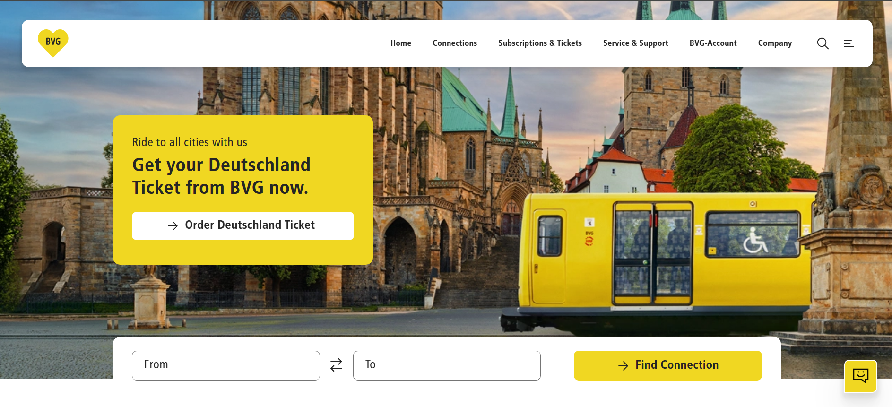
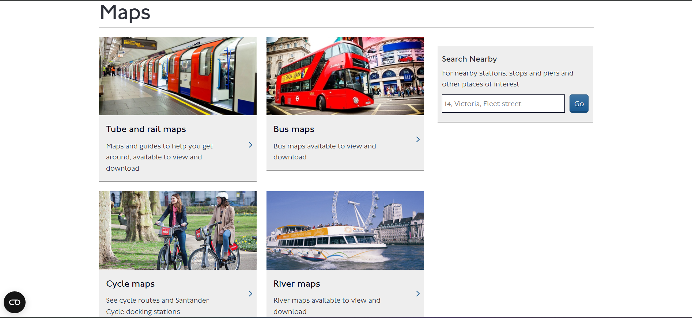
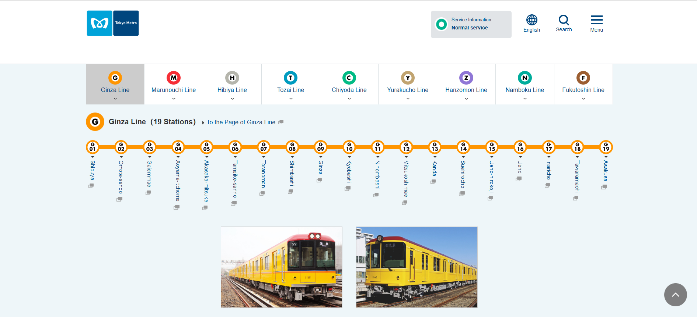
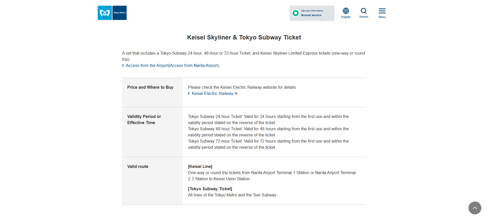

# Metro System Research & Brainstorm

**Researcher:** Nilupuli Geethma  
**Date:** 2026-03-09  
**Branch:** `doc/nilupuli-research`

---

## 1. Websites Reviewed

| # | Country | System Name | URL | Date Visited |
|---|---------|-------------|-----|--------------|
| 1 | Germany | BVG Berlin | https://www.bvg.de/en | 2025-03-09 |
| 2 | London | Transport for London | https://tfl.gov.uk | 2025-03-09 |
| 3 | Tokyo | Tokyo Metro | https://www.tokyometro.jp/en/index.html | 2025-03-09 |

> ⚠️ **Note:** You must visit these websites yourself and take your own screenshots. Do not copy content from AI tools.

---

## 2. Key Features Observed

### 🔵 Germany – BVG Berlin

*Screenshot taken: 2025-03-09*

**Features noticed:**
- Users can enter the starting location and destination to find the best route
- Real-time service updates (Information about disruptions, construction work, or delays)
- Users can view details about stations and transport connections
- Mobile app download links prominently placed(Apps such as BVG Fahrinfo and Jelbi allow users to plan routes and buy tickets digitally)
- Germany’s transport ministers have decided on an ‘introductory period’ for the Deutschland Ticket that will run for at least two years.

**My observation:** The website provides real-time service updates, which help users stay informed about delays, disruptions, or construction work affecting the transport system. This feature is very useful for daily commuters.

---

### 🔴 London – Transport for London (TfL)

*Screenshot taken: 2025-03-09*

*Screenshot taken: 2025-03-09*

**Features noticed:**
- TfL Go app allows journey planning, live updates, and ticket top-up.
- Accessibility information (step-free access)
- Oyster cards, contactless payments, fare calculators, daily/weekly caps.
- Journey planner with multiple transport modes
- Disruption alerts banner at the top
- Tube maps, bus maps, cycling routes, payment zone maps.

**My observation:** TfL handles disruptions very transparently. Sri Lanka could benefit from a clear "service status" section so passengers aren't confused during delays.

---

### 🟠 Tokyo Metro

*Screenshot taken: 2025-03-09*

*Screenshot taken: 2025-03-09*

*Screenshot taken: 2025-03-09*

**Features noticed:**
- Users can enter their starting station and destination to find the fastest route.
- Tourist-focused features (English, Chinese, Korean)
- Station facilities info (toilets, elevators, exits)
- Lost and found section
- IC card (Suica/Pasmo) information
- Visitors can view options like 24-hour, 48-hour, and 72-hour subway tickets.

**My observation:** The Tokyo Metro website is very informative and user-friendly. It provides many tools that help both local passengers and tourists plan their travel easily. The multilingual support and clear route maps are especially useful.

---

## 3. UI/UX Observations

| Aspect | What I Noticed | Good for Sri Lanka? |
|--------|---------------|---------------------|
| Color scheme | Each system has a consistent brand color | ✅ Yes – use Sri Lankan national colors |
| Navigation | Simple top nav with 4-5 main items | ✅ Yes – keep it minimal |
| Mobile responsiveness | All three sites work well on phone | ✅ Must have |
| Language support | Multiple languages available | ✅ Sinhala, Tamil, English needed |
| Maps | Interactive SVG/JS maps | ✅ Priority feature |
| Accessibility | TfL has the best accessibility info | ✅ Include for inclusivity |

---

## 4. Suggested Features for Sri Lanka Metro Website

### Must Have
- [ ] Interactive route map
- [ ] Station list with nearby landmarks
- [ ] Fare information
- [ ] Operating hours
- [ ] Sinhala / Tamil / English language toggle
- [ ] Mobile responsiveness

### Good to Have
- [ ] Real-time train status
- [ ] Journey planner
- [ ] Mobile app link
- [ ] News & announcements section
- [ ] Contact / lost & found
- [ ] Customer care options

### Future Consideration
- [ ] Tourist guide integration
- [ ] QR code ticketing info
- [ ] Accessibility guide per station
- [ ] Accessibility features for disabled passengers

---

## 5. My Personal Opinion

For Sri Lanka, I would prioritize building a mobile-responsive website with an interactive route map, journey planner, and real-time updates, as these features would immediately improve passenger experience. Later, I would expand to include tourist guides, accessibility information, and digital ticketing options to make the system modern, inclusive, and internationally friendly.

Features like real-time service updates, interactive route maps, and mobile app integration stand out as essential for daily commuters. TfL’s accessibility information and Tokyo Metro’s multilingual support are particularly commendable and would greatly benefit passengers in Sri Lanka.

---

## 6. References

- BVG Berlin Germany – https://www.bvg.de/en – visited 2025-03-09
- Transport for London – https://tfl.gov.uk – visited 2025-03-09
- Tokyo Metro – https://www.tokyometro.jp/en – visited 2025-03-09
