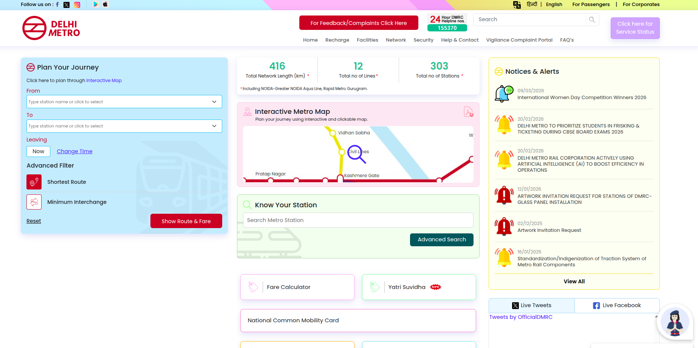
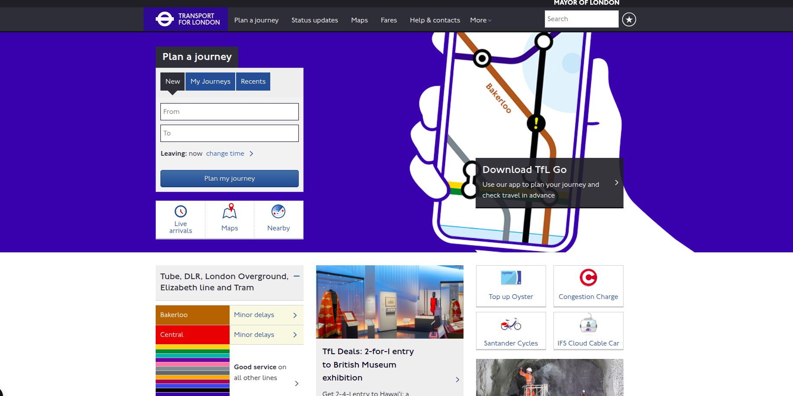
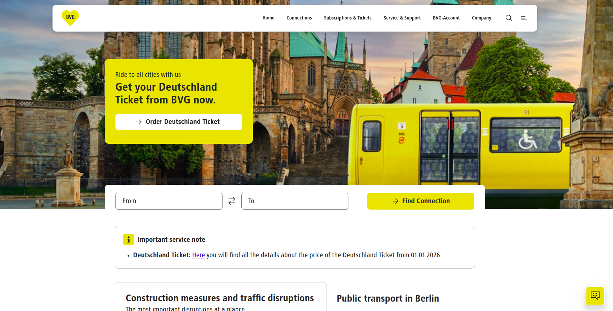

# Metro System Research & Brainstorm

**Researcher:** Oshana Fernando  
**Date:** 2026-03-09  
**Branch:** `doc/oshana-research`

---

## 1. Websites Reviewed

| # | Country | System Name | URL | Date Visited |
|---|---------|-------------|-----|--------------|
| 1 | India   | Delhi Metro Rail Corporation (DMRC) | https://delhimetrorail.com/ | 2026-03-09 |
| 2 | London  | Transport for London | https://tfl.gov.uk | 2026-03-09 |
| 3 | Germany | Berlin Public Transport | https://bvg.de/en | 2026-03-09 |

> ⚠️ **Note:** You must visit these websites yourself and take your own screenshots. Do not copy content from AI tools.

---

## 2. Key Features Observed

### 🔵 India – Delhi Metro Rail Corporation

*Screenshot taken: 2026-03-09*

**Features noticed:**
- plan metro journeys
- Multilingual support (English, Hindi)
- Allow users to submit complaints and feedback
- Fare calculator
- Has an AI Assistant to help users
- System includes an interactive metro map
- provides a notices section to clearly communicate important updates
- Provide security features when travelling
- Have a good FAQ database

**Weaknesses / Limitations:**
- user interface is not well organized
- Design of the interface looks slightly outdated
- Homepage contains too much text information

**My observation:** the Delhi Metro website is useful for passengers because it provides important travel information such as routes, fares, and journey planning. However, the website design and technical aspects need improvements to make it more modern and user-friendly.

---

### 🔴 London – Transport for London (TfL)

*Screenshot taken: 2026-03-09*

**Features noticed:**
- Provide safety features when travelling 
- User-friendly and easy to access
- Available on Android and iOS (Mobile Optimized)
- On-site journey planner facility
- Help and contact section for user support
- Separate section for fares and updates

**Weaknesses / Limitations:**
- Occasional Google ads that may distract or harm users

**My observation:** Although some ads are shown, the overall user experience is better compared to other sites and is generally good.

---

### 🟠 Germany – Berlin Public Transport

*Screenshot taken: 2026-03-09*

**Features noticed:**
- Eye-catching user interface on visiting the site
- Clear notices and updates section for important service information
- Separate mobile apps for specialized functions
- Dedicated section for tourists
- Separate section for tickets and tariffs
- Well-optimized for mobile devices
- Multilingual support (English, German)

**Weaknesses / Limitations:**
- Integrated map can be laggy

**My observation:** This website is well-designed and user-friendly, providing clear information and useful features, making it highly effective for passengers.
---

## 3. UI/UX Observations

| Aspect | What I Noticed | Good for Sri Lanka? |
|--------|---------------|---------------------|
| Color scheme | all websites use a good overall color scheme, but some sites have menus or sections with colors that don’t fully match the main theme. | ✅ Yes – use Consistent colors scheme |
| Navigation | some websites have cluttered or confusing navigation some are simple | ✅ Yes – keep it minimal |
| Mobile responsiveness | some websites offer multiple apps, but all of them are responsive and work well on mobile devices. | ✅ Must have |
| Language support | All websites offer multiple languages — usually the local language plus English — which helps both locals and tourists navigate easily. | ✅ Sinhala, Tamil, English needed |
| Maps | Maps are interactive, but most integrated maps tend to be laggy and slow to load. | ✅ Key feature |
| Accessibility | all websites provide some form of accessibility, such as readable text, contrast, or basic navigation support. | ✅ High – essential for inclusivity in Sri Lanka |
| Icons & Symbols | some websites use icons that don’t fully match in style. | ✅ Use consistent style across site |

---

## 4. Suggested Features for Sri Lanka Metro Website

### Must Have
- [ ] Search bar for stations and routes
- [ ] Service alerts banner
- [ ] Interactive route map
- [ ] Fare information
- [ ] Sinhala / Tamil / English language toggle

### Good to Have
- [ ] Real-time Bus status Tracking
- [ ] Journey planner Facility
- [ ] News & announcements section
- [ ] Contact / lost & found
- [ ] Parking information at stations
- [ ] Nearby transport connections
- [ ] User feedback / complaint form

### Future Consideration
- [ ] Push notifications for delays
- [ ] Tourist travel pass information
- [ ] Tourist guide integration
- [ ] QR code ticketing info

---

## 5. My Personal Opinion

The most important factor for a metro website is ease of use. The system should be simple and require minimal steps so that any user can quickly find information such as routes, fares, and station details.

I also think it is better to avoid adding too many complex features and instead keep the system minimal and focused on the most important services. Using a consistent design style across the whole website is important so users do not get confused when navigating different sections.

Finally, the website must be mobile friendly, since many people access services from their phones. Developing a mobile app alongside the website would also make it easier for passengers to use the metro system.

---

## 6. References

- Delhi Metro Rail Corporation (DMRC) – https://delhimetrorail.com/ – visited 2026-03-09
- Transport for London – https://tfl.gov.uk – visited 2026-03-09
- Berlin Public Transport – https://bvg.de/en – visited 2026-03-09
