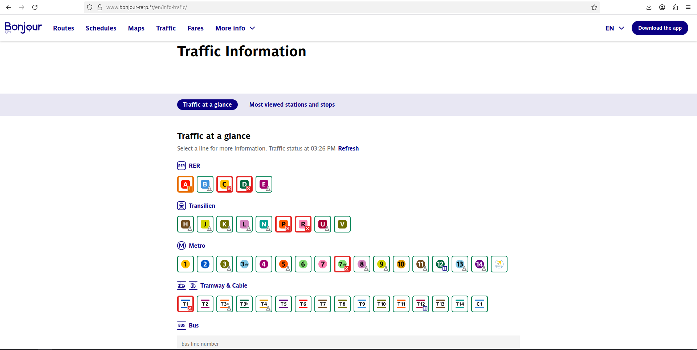
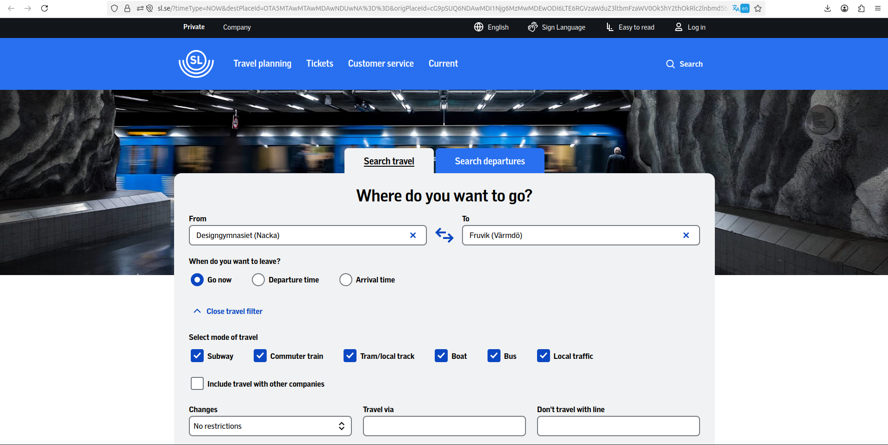

# Metro System Research & Brainstorm

**Researcher:** Sankalya Tharindi  
**Date:** 2026-03-07
**Branch:** `doc/sankalya-research`

---

## 1. Websites Reviewed

| # | Country | System Name | URL | Date Visited |
|---|---------|-------------|-----|--------------|
| 1 | France | Bonjour RATP | https://www.bonjour-ratp.fr/en/ | 2026-03-07 |
| 2 | Netherlands | 9292 | https://9292.nl/en/ | 2026-03-07 |
| 3 | Sweden | Storstockholms Lokaltrafik | https://sl.se/ | 2026-03-07 |

## 2. Key Features Observed

### 🔵 France – Bonjour RATP

*Screenshot taken: 2026-03-07*

**Features noticed:**
- Accessible travel options for disable passengers
- Web app is mobile responsive and mobile app option is also there.
- Full map with services and shops inside the metro stations are included and the maps can be downloaded.
- Traffic situation and maintainance for each lane for each metro type is displyed.
- Real time news related to transportation option is there.
- French and English languages supported.

**My observation:** The map with facilities inside the metro stations is very clear and impressive, the traffic information for each lane for each metro type is very convenient for daily passengers and Sri Lanka could incude thia option in our systems.

---

### 🔴 Netherlands - 9292

*Screenshot taken: 2026-03-07*

**Features noticed:**
- Accessibility options when planning trips for disable passengers.
- E ticket buying options with fares calculated for each route.
- Days out and overseas trip planning options based on seasonal activities in each region.
- Convenient travel options supported for international travellers and students.
- Downloadable mobile app available.
- Playlist generator option through the system via spotify.

**My observation:** The trip planning options and the plans for students are very impressive. Sri lanka could get an influence for accurate fare calculation for each route.

---

### 🟠 Sweden - Storstockholms Lokaltrafik

*Screenshot taken: 2026-03-07*

**Features noticed:**
- Traffic situation available for each routes and custom option.
- Ticket purchasing options through QR scan and discounts for elders,students and holiday tickets for youth.
- Safety centre chat options for reporting issues encountered.
- Latest news option related to transportation.
- Detailed guidelines about system, tickets and transport service is given in sign language.

**My observation:** The ticket purchasing options are very clear and detailed and sign language options are accessible. Sri lankan system could get an influence for customer care through the system.

---

## 3. UI/UX Observations

| Aspect | What I Noticed | Good for Sri Lanka? |
|--------|---------------|---------------------|
| Color scheme | Each system has used user friendly color palatte for buttons, links | ✅ Yes – better to use a standard color palatte
| Navigation | Simple top nav with 4-5 main items | ✅ Yes – keep it minimal |
| Mobile responsiveness | All three sites work well on phone and all have mobile app option | ✅ Must have |
| Language support | Multiple languages available | ✅ Sinhala, Tamil, English needed |
| Maps | Interactive SVG/JS maps | ✅ Priority feature |
| Accessibility | Sweden SL has used best accessibility info | ✅ Include for inclusivity |

---

## 4. Suggested Features for Sri Lanka Metro Website

### Must Have
- [ ] Interactive route map with traffic information
- [ ] Station list with nearby landmarks and services/shops
- [ ] Fare information with paying options through system
- [ ] Operating hours 
- [ ] Sinhala / Tamil / English language toggle
- [ ] Customer care options
- [ ] Mobile responsiveness

### Good to Have
- [ ] Real-time train status
- [ ] Journey planner
- [ ] Mobile app link 
- [ ] News & announcements section
- [ ] QR code ticketing info

### Future Consideration
- [ ] Tourist guide integration
- [ ] Accessibility guide per station
- [ ] Accessibility features for disabled passengers

---

## 5. My Personal Opinion

I believe Sri Lankan systems can influence highly by how these systems have represented the traffic information, deleys, maintainenece activities for each routes. The facilities and shops around the stations and stops can provide a user friendly experience.
The mobile responsiveness of the web app and mobile app download option could be very helpful for travellers.
Mostly the customer care option for reporting issues is very helpful to monitor the user experience.

---

## 6. References

- France – Bonjour RATP – https://www.bonjour-ratp.fr/en/ – visited 2026-03-07
- Netherlands - 9292 – https://9292.nl/en/ – visited 2026-03-07
- Sweden - Storstockholms Lokaltrafik – https://sl.se/ – visited 2026-03-07
