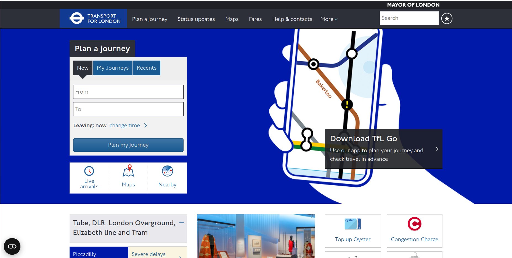
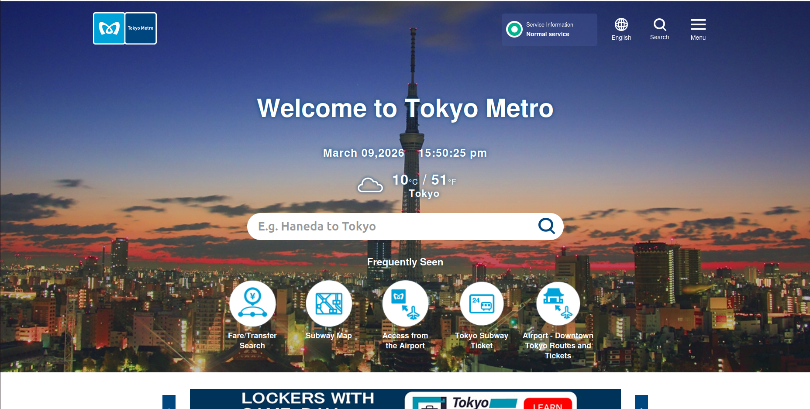
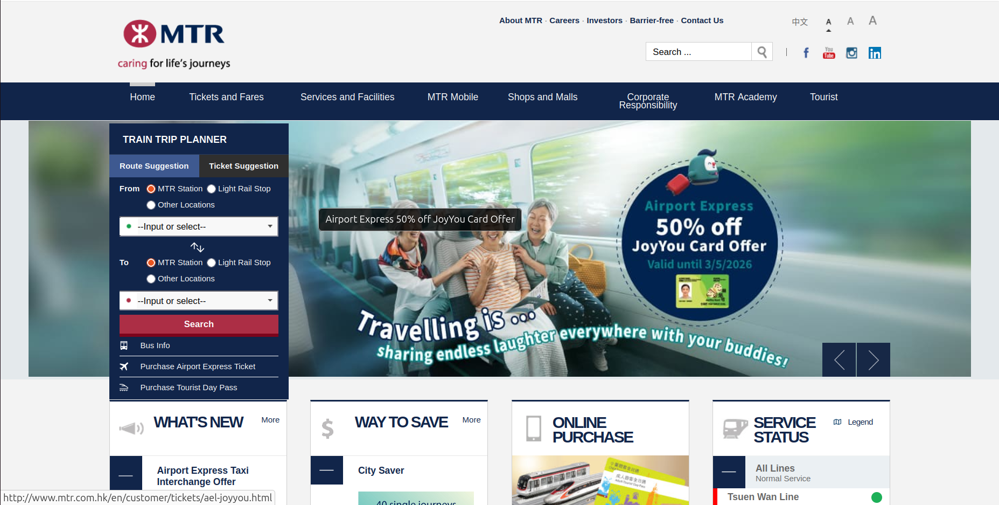
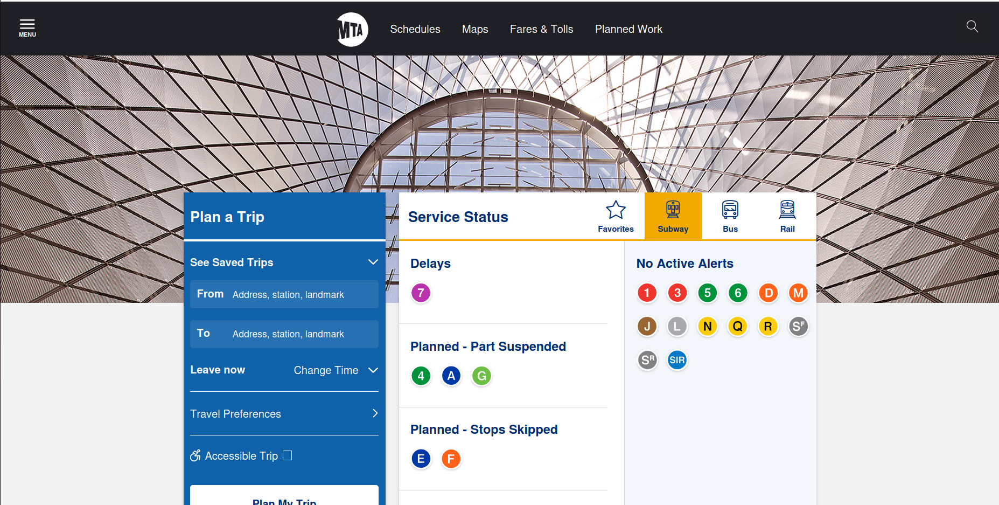

# Metro System Research & Brainstorm

**Researcher:** Dinusha Amarasinghe 
**Date:** 2026-03-09  
**Branch:** `doc/dinusha-research`

---

## 1. Websites Reviewed

| # | Country | System Name | URL | Date Visited |
|---|---------|-------------|-----|--------------|
| 1 | Singapore | SMRT / TransitLink | https://www.transitlink.com.sg | 2026-03-09 |
| 2 | London | Transport for London | https://tfl.gov.uk | 2026-03-09 |
| 3 | Tokyo | Tokyo Metro | https://www.tokyometro.jp/en | 2026-03-09  |
| 4 | USA | New York MTA  | https://new.mta.info | 2026-03-09  |
| 5 | Hong Kong | Hong Kong MTR | https://www.mtr.com.hk | 2026-03-09  |

> ⚠️ **Note:** You must visit these websites yourself and take your own screenshots. Do not copy content from AI tools.

---

## 2. Key Features Observed

### 🟠 Singapore – TransitLink

*Screenshot taken: 2026-03-09*

**Features noticed:**
- route planner
- MRT + bus integration
- fare calculator
- smart card management
- travel alerts

**My observation:** The smart ticketing system is very useful to day to day users and visitors because it provides strong payment intergration and clear route information.

---

### 🟠 London – Transport for London (TfL)

*Screenshot taken: 2026-03-09*

**Features noticed:**
- have Advanced journey planner
- shows live service status
- have Oyster card payments
- shows route maps
- have accessibility information
- shows disruption alerts

**My observation:** London’s transport platform allows millions of journey planning queries every day and provides fare and live departure information.

---

### 🟠 Tokyo Metro

*Screenshot taken: 2026-03-09*

**Features noticed:**
- have Route planner to search for fare and transfer
- have Interactive subway map
- shows station information
- have tourist travel guides
- have airport transport information
- interface supports multi languages

**My observation:** The Tokyo Metro website provides route search, subway maps, ticket information, and travel tips for visitors. Visitors can view the information in many languages.

---

### 🟠 Hong Kong MTR

*Screenshot taken: 2026-03-09*

**Features noticed:**
- trip planner
- real-time train schedule
- station facilities
- Octopus smart card
- travel guides

**My observation:** One of the most efficient metro systems which has detailed station information.

---

### 🟠 New York MTA

*Screenshot taken: 2026-03-09*

**Features noticed:**
- subway map
- train arrival times
- service alerts
- OMNY contactless payment
- accessibility tools

**My observation:** The website have travel planner along with alert system and interactive map

---

## 3. UI/UX Observations

| Aspect | What I Noticed | Good for Sri Lanka? |
|--------|---------------|---------------------|
| Color scheme | Each system uses strong brand colors (TfL red, Tokyo Metro blue) | ✅ Yes – Use Sri Lanka rail blue/red or national colors |
| Navigation | Most sites have 4–6 main menu items | ✅ Yes – Ideal for Sri Lankan users |
| Mobile responsiveness | Fully responsive design | ✅ Essential |
| Language support | Multiple languages for tourists and locals | ✅ Sinhala / Tamil / English |
| Maps | ISVG or WebGL interactive maps | ✅ High priority |
| Accessibility | TfL shows elevator, wheelchair access | ✅ Important for inclusivity |
| Search Function | Most sites include station search | ✅ Must implement |
| Visual Hierarchy | Large route planners on homepage | ✅ IShould be homepage focus |

---

## 4. Suggested Features for Sri Lanka Metro Website

### Must Have
- [✅] Interactive Route Map
- [✅] Station Information Pages
- [✅] Fare Information
- [✅] Operating hours
- [✅] Language Support
- [✅] Station Search
- [✅] Route Information
- [✅] Mobile Responsive Design

### Good to Have
- [✅] Real-time train status
- [✅] Journey planner
- [✅] Mobile App Integration
- [✅] News and Announcements Section
- [✅] Contact and Support Page
- [✅] Lost and Found Reporting
- [✅] Service Alerts
- [✅] Downloadable Maps

### Future Consideration
- [✅] Tourist Transport Guide
- [✅] QR Code Ticketing System
- [✅] Accessibility Information
- [✅] Smart Card Integration
- [✅] Real-Time Train Tracking Map
- [✅] Crowd Density Information
- [✅] Multimodal Transport Integration
- [✅] AI-Based Travel Recommendations

---

## 5. My Personal Opinion

> *Write this in your own words. What did you personally find most useful? What do you think Sri Lanka needs most?*

After reviewing several international public transport websites such as Tokyo Metro, Transport for London, and Singapore TransitLink, I identified several features that are particularly useful for passengers. One of the most useful features I found was the journey planner. This tool allows users to enter their starting point and destination, and the system automatically suggests the best route, travel time, and possible transfers. I believe this feature is extremely helpful because it saves time and helps passengers easily understand how to reach their destination using public transport.

Another feature that stood out to me was the interactive route map. Instead of only showing a static map, these websites provide interactive maps where users can click on stations to view additional information such as facilities, nearby landmarks, and connecting transport options. This makes navigation much easier, especially for people who are unfamiliar with the transport system or visiting the city for the first time.

I also found the real-time service updates to be very valuable. These updates inform passengers about delays, disruptions, or maintenance work. Having access to this information allows passengers to adjust their travel plans and avoid unnecessary waiting time.

In my opinion, the most important features that Sri Lanka needs are clear route information, an interactive map, and a journey planning system. Currently, many passengers rely on asking others or searching multiple sources to find transport information. A centralized website with accurate and easy-to-use information would greatly improve the passenger experience.

Sri Lanka would also benefit from providing multilingual support, including Sinhala, Tamil, and English, so that both local passengers and international tourists can easily access transport information. Additionally, ensuring that the website is mobile-friendly is important because many people use smartphones while traveling.

Overall, implementing these features would make public transportation information in Sri Lanka more organized, accessible, and user-friendly. It would also help encourage more people to use public transport by making travel planning simpler and more reliable.

---

## 6. References

- TransitLink Singapore – https://www.transitlink.com.sg
 – visited 2026-03-09 
- Transport for London – https://tfl.gov.uk
 – visited 2026-03-09 
- Tokyo Metro – https://www.tokyometro.jp/en
 – visited 2026-03-09 
- Hong Kong MTR – https://www.mtr.com.hk
 – visited 2026-03-09 
- New York MTA – https://new.mta.info
 – visited 2026-03-09 
